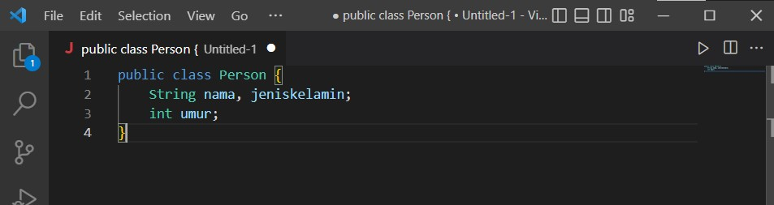
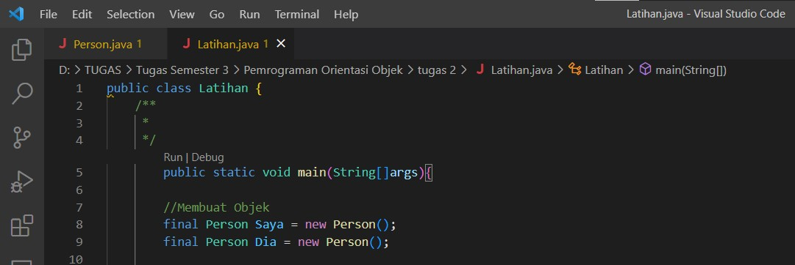
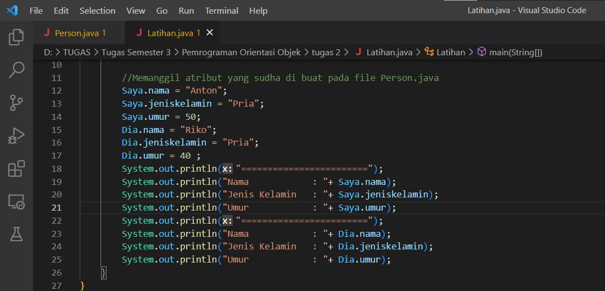
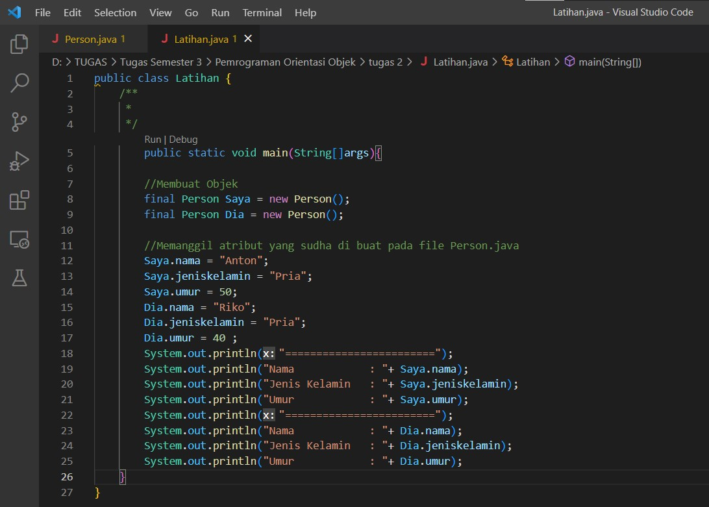
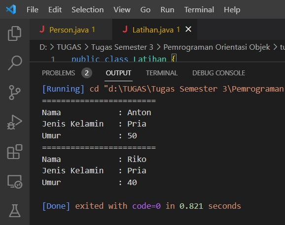

# Laporan-Praktikum1
# Latihan 1

# KODE PROGRAM JAVA
1. Mendeklarasikan class Person, dengan atribut Nama, JenisKelamin, Umur

    - Dalam mendeklarasikan clas dengan atribut nama, jenis kelamin dan umur kita memerlukan type data String dan integer. berikut programnya :
    

2. Buat dua buah objek dari class Person bernama Anton dan Riko

    - Selanjutnya kita membuat 2 buah objek dalam class Person, objeknya yaitu Saya dn Dia. berikut programnya :

    

    - Setelah membuat objek lalu kita membuat atribut dalam objek. Atributnya yaitu nama, jenis kelamin dan umur untuk nama dan jenis kelamin kita menggunakan type data string dan umur type data integer. breikut programnya :

    

    - Berikut merupakan program keseluruhannya.

    

    - Ini hasil dari membuat 2 buah objek dalam class person.

    

=================================== TERIMA KASIH ===================================